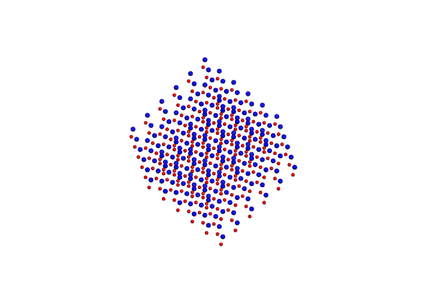

===========
Quick Start
===========

**Uppasd_tools** is designed to process UppASD simulation output and provide
a convenient Python interface for inspecting, summarizing, and post-processing
simulation results.

The output files of UppASD simulations are named as
`prefix.SIMID.out`, where `SIMID` is simulation id, 8-character string set in the UppASD main input file, `inpsd.dat`.
Ideally, all results of your simulation are stored in one directory. 
To process these files, initialize UppOut object, which checks the directory, finds available output files, 
and extracts available parameters.

.. code-block:: Python

    from uppasd_tools import UppOut

    uppout = UppOut('/path/to/UppASD/directory')

It is important, that all the output files share the same `SIMID`, which means they were produced by the same simulation.
In case, you have stored outputs of multiple simulations in the same directory, UppOut will raise an error. 
You can correct it by specifying given `SIMID`.

.. code-block:: Python

    uppout = UppOut('/path/to/UppASD/directory', simid='simid001')

Summarize UppASD directory
--------------------------

Once you initialized `UppOut` object, you can review the information gathered in the uppout instance.
This provides a quick overview of the simulation setup and available data,
which is often the first thing to check before any analysis.

.. code-block:: Python

    uppout.summary()

.. code-block:: text

    Output directory: /path/to/UppASD/directory
    Simulation ID: simid001
    Available output files: ['averages', 'coord', 'cumulants', 'mcinitial', 'restart', 'stdenergy', 'struct', 'totenergy']
    ---
    Number of atoms in the unit cell: 2
    Number of atom types: 1
    Total number of atoms in the supercell: 432
    Number of ensembles in the simulation: 5
    xrange: (0.0, 5.5)
    yrange: (0.0, 5.5)
    zrange: (0.0, 5.5)

Read UppASD output files
------------------------

UppOut holds simulation ID in `uppout.simid` and prefixes of all available output files in `uppout.prefixes`.
To read an output file you can use any of the function listed 
in :doc:`uppasd_tools.uppout reference <uppout>`.

For instance to read the `averages.simid001.out` file use

.. code-block:: Python

    df_averages = uppout.read_averages()

which returns a pandas dataframe containing the data from the file

+------+--------+--------+--------+--------+----------+
| iter | Mx     | My     | Mz     | M      | M_stdv   |
+======+========+========+========+========+==========+
| ...  | ...    | ...    | ...    | ...    | ...      |
+------+--------+--------+--------+--------+----------+

The table contains averaged magnetization components and their standard deviation
as a function of Monte Carlo iteration.
More details on UppASD output files you can find in the `UppASD Manual <https://uppasd.github.io/UppASD-manual/output/>`_.

If you need to see final magnetic configurations, stored in `restart.simid001.out` file, use

.. code-block:: Python

    final_configs = uppout.final_configs()

This will return list of pandas DataFrames. 
Each DataFrame contains magnetic configuration for one of the simulated member of the ensemble.

For more advanced usage examples, see the 
`example Jupyter notebook <https://github.com/LLapsus/uppasd_tools/blob/78e493ae3d7236fcbab24c5b8ed11649b91f53fa/examples/read_output_files.ipynb>`_.

Visualization
-------------

**Uppasd_tools** allows you to visualize the supercell generated by UppASD.
To this end uppasd_tools uses `py3Dmol`, which provides 3D interactive visualization
of the atomic structure.

.. code-block:: Python

    from uppasd_tools.visualize import visualize_supercell

    # Visualize the supercell structure
    view = visualize_supercell(
        uppout,
        type_to_symbol={1: "Fe", 2: "Co"},
        symbol_to_color={"Fe": "red", "Co": "blue"},
        symbol_to_scale={"Fe": 0.06, "Co": 0.08},
        # xlim=(0,2), ylim=(0,2), zlim=(0, 2),
        scale=0.1, rotate=(30, 10, 45)
    )
    view.show()

Analogically, one can visualize static magnetic configurations.

To learn more about visualization in uppasd_tools visit :doc:`uppasd_tools.visualize <visualize>` section 
or review the
`example Jupyter notebook <https://github.com/LLapsus/uppasd_tools/blob/78e493ae3d7236fcbab24c5b8ed11649b91f53fa/examples/visualize_structure.ipynb>`_.